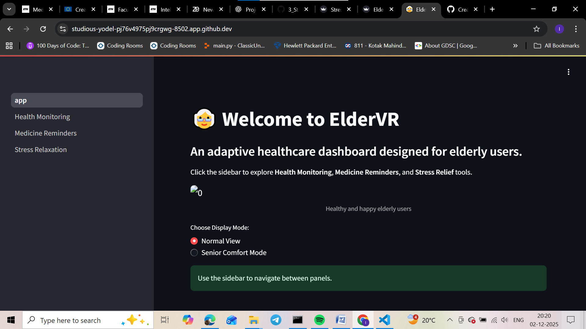
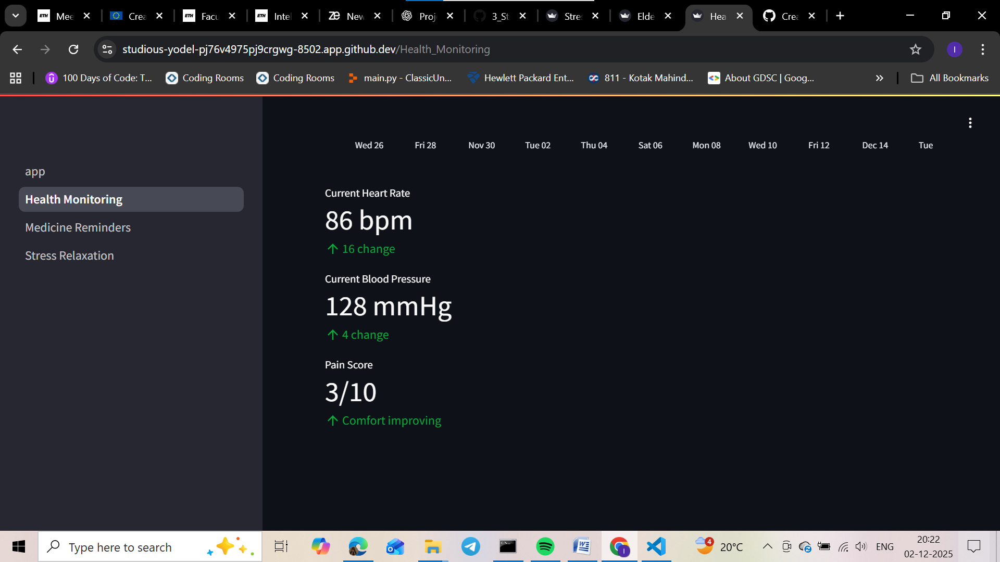

👵 ElderVR — Adaptive Healthcare Dashboard for Elderly Users

ElderVR is a user-friendly **health monitoring and stress management dashboard** designed specially for elderly individuals.  
The interface focuses on **simplicity, comfort, soft visuals, and zero cognitive overload** — so that every user, regardless of age, can manage health effortlessly.


## 🌟 Key Features

🔹 **Health Monitoring** — Blood pressure, heart rate, daily physical activity & sleep tracking  
🔹 **Medicine Reminders** — Simple reminders with visual cards & checkboxes  
🔹 **Stress & Relaxation Therapy** — Guided breathing, calming music & mental wellbeing tools  
🔹 **Large fonts, soft colors & minimal navigation** — Designed for seniors  
🔹 **Dark/Light theme toggle**  
🔹 **Accessible UX — voice buttons & simple instructions (optional module)**  


## 🖼️ Screenshots

### 🏠 Home Screen


### ❤️ Health Monitoring




### 💊 Medicine Reminder


### 🧘‍♀️ Stress & Relaxation Therapy


## 🚀 Run Locally

```bash
git clone https://github.com/illmaahh/ElderVR.git
cd ElderVR
pip install -r requirements.txt
streamlit run app.py
```


## 🧠 Tech Stack

| Technology | Purpose |
|-----------|---------|
| Python | Core backend |
| Streamlit | UI development |
| Pandas | Data handling |
| Matplotlib | Graph visualizations |
| CSS | UI theming |


## 👩‍⚕️ Why ElderVR?

Most health apps are not designed for elderly users — small text, complicated UI, too many options.  
ElderVR solves this by providing:

✔ Bigger buttons  
✔ Calm visuals  
✔ Simple navigation  
✔ Health + Medicine + Stress tools in one dashboard  

ElderVR is not just a project — it’s an effort to support elderly healthcare independence.


## 📬 Contribution

Contributions are welcome! You can improve UI, voice integration, or add more stress-relief modules.

---

## ✨ Author

**Ilma Rasheed**  
B.Tech — CSA

